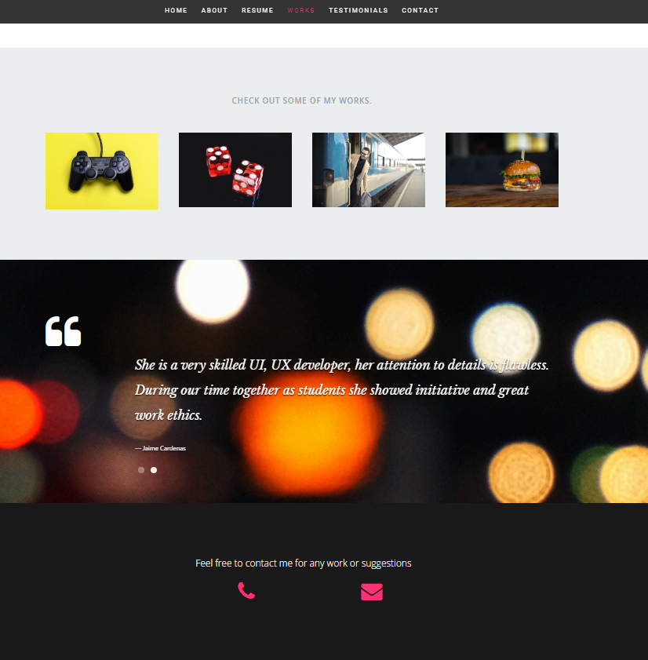

#### Full Stack Developer 

- - -

### First Personal Proyect built on ReactJS

- - - - 

##### Technologies

*  Libraries and languages used for accomplished this assignment 

    #
    * __Front End__
        * HTML
        * CSS & React Bootstrap
        * Javascript
        * ReactJS

        ###
    * __Back End__
        * Node.js
        * Express
        * NPM

To learn more about Mongoose, click [here!](https://www.npmjs.com/package/mongoose)

### [Here you can execute my project](https://ucf-pr3.herokuapp.com/)

*If any suggestion, do not hesitate to contact me on my personal email: marcia.gzq@gmail.com
I would appreciate any comment, I know it may be very beneficial on my professional growth.*
